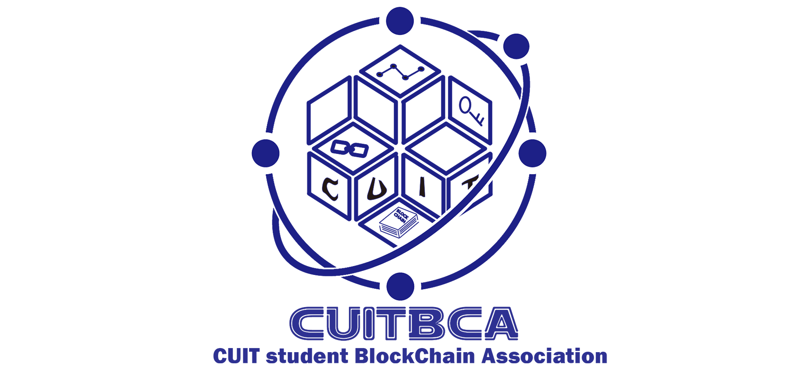

# Aptos-knowledge-base

## 介绍

💡Aptos入门知识库是由ACLOVE与CUITBCA联合发起的活动 
💡旨在帮助热爱Web3的新鲜血液通过Aptos轻松入门 
💡顺畅融入Web3世界 

## 关于ALCOVE

https://alcove.pro/cn 
🔦ALCOVE 是亚洲首个由 Aptos 公链与 Alibaba Cloud 携手打造的 Move on Aptos 中文开发者社区 
🌟致力帮助开发者使用 Move 语言在 Aptos 构建下一代 Web3 应用 

## 关于我们

We are a group of passionate crypto enthusiasts❤️‍🔥 
activelyimmersedin Web3🌴 
dedicated to drivingindustrydevelopment and fostering intercollegiateexchange.🤘 
 
——CUITBCA
 
我们是一群Crypto狂热信徒❤️‍🔥 
积极融入Web🌴3 
致力于推动行业发展,促进跨校交流。🤘  
 
——成都信息工程大学学生区块链协会
