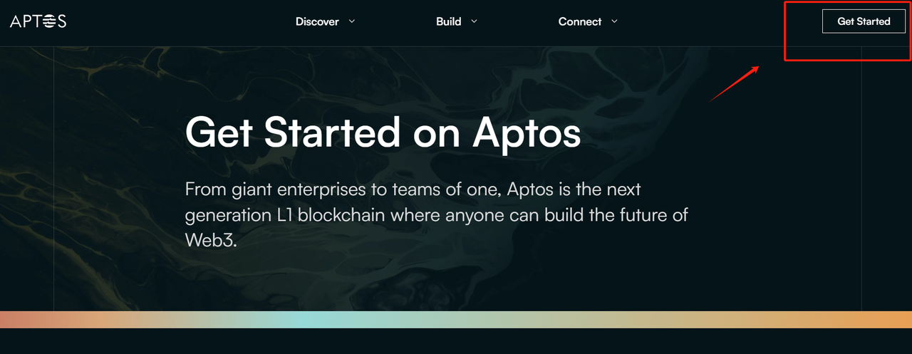
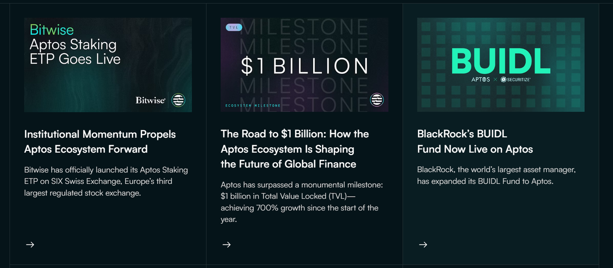
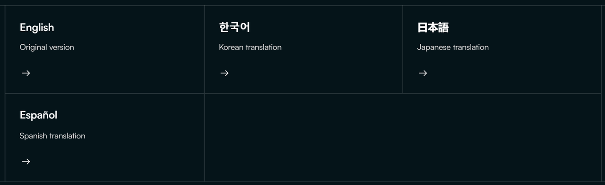
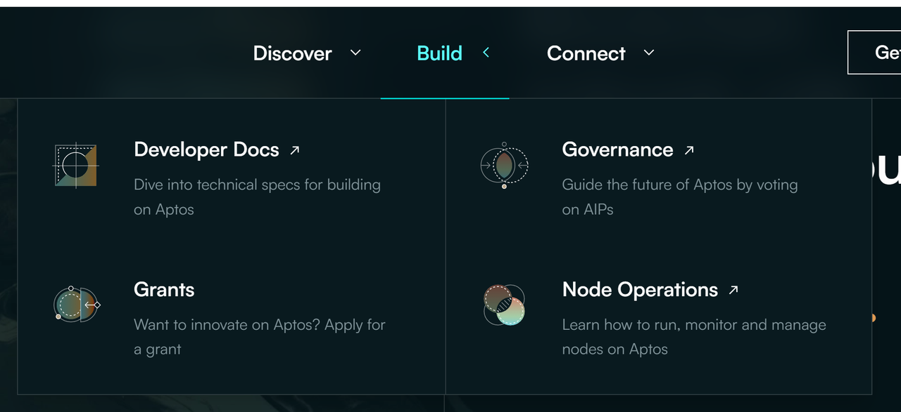
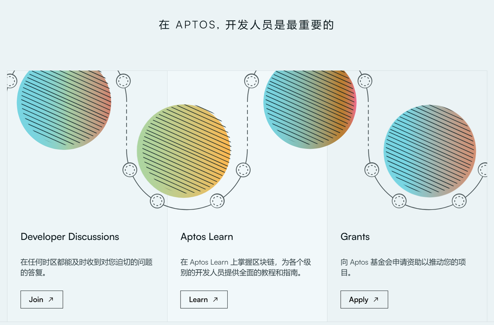
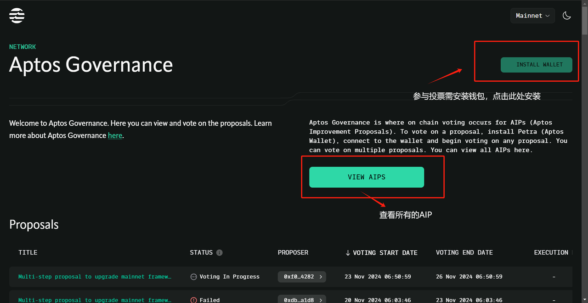
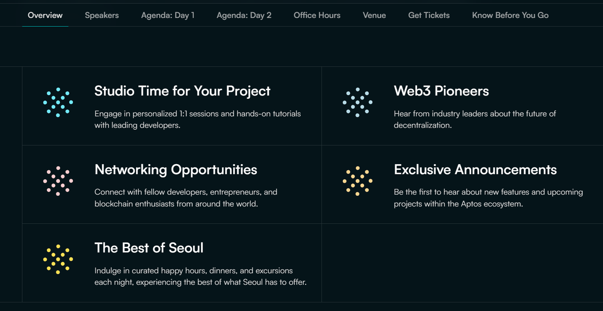
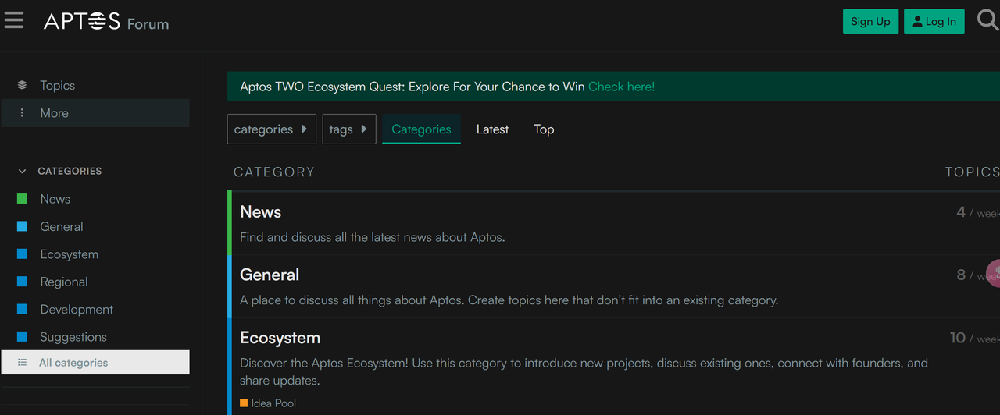

# Aptos 网站<del>食用</del>使用手册

## 官网地址：
https://aptosfoundation.org/
自行开始探索
> 点击“get start”，自行探索你感兴趣的领域！

点击对应tag可以直接跳转至对应区域.PNG)

### 菜单栏 - discover

#### Use Cases

https://aptosfoundation.org/use-cases 

主要包括应用Aptos技术的项目用例：NFT、DEFI、Game、Social、AI等等，这些用例组成了Aptos繁荣的生态。

#### Ecosystem Project.PNG)

整合了Aptos链上的现有项目，包括项目简介及官网等相关链接（以Liquidswap为例）
.PNG)

#### Blog

有关Aptos当前/过去的重大更新和升级，通常以研报的形式呈现，涵括技术、生态、行业等新闻。可通过此了解aptos的最新技术创新，项目和区块链行业见解。

可在最下方处订阅更新

#### White paper 

https://aptosfoundation.org/whitepaper
详尽介绍Aptos架构共识、技术的论文，有多种语言可以选择，中文版的建议看

[Buidler DAO]: https://medium.com/@BuidlerDAO/buidler-dao-x-aptos-%E7%99%BD%E7%9A%AE%E4%B9%A6%E5%AE%98%E6%96%B9%E6%8E%88%E6%9D%83%E4%B8%AD%E6%96%87%E7%89%88%E6%AD%A3%E5%BC%8F%E5%8F%91%E5%B8%83-8056dbabff9b

### 菜单栏 - Build

#### Developer Docs

开发者文档，目前有中文和英文两个版本
中文： https://aptos.dev/zh
英文： https://aptos.dev/en

讨论、学习、申请Grant，Aptos保持着对开发人员的尊重

#### Governance

https://governance.aptosfoundation.org/
针对 AIP（Aptos 改进提案)进行链上投票的地方

#### Node Operations

https://aptos.dev/en/network/nodes
有关节点运营者的一些文档

可通过下图处快速链接到有关 Aptos 上的验证、质押和治理工作原理的所有信息

此处还有Aptos的术语表 简洁介绍了大部分术语的概念（范围参考下图右方索引）

### 菜单栏 - connect

#### event

Aptos社区的相关活动要闻
即将上线的活动(Upcoming Events)：The Aptos Experience

过去的活动（Past Events)：

#### Discord

https://discord.com/invite/zTDYBEud7U 

（ps: Discord是一个专为游戏玩家设计的免费语音、视频和文本聊天应用程序。它允许用户创建自己的服务器，并在这些服务器上创建多个聊天频道）

#### Discussion Forum

Aptos论坛，包括生态、开发等多个方面
https://forum.aptosfoundation.org/

你可以通过种类，标签等方式在论坛查找你所需要的信息（如生态相关)

在论坛底部，可以看到：

1. aptos的隐私条款及使用条款
2. aptos的其他链接
