# 基本语法及环境配置资料

#### **Move语言白皮书**：https://developers.diem.com/docs/technical-papers/move-paper/

#### **CSDN**：https://blog.csdn.net/m0\_45605854/article/details/127557661

#### **Move 编程语言 GitHub 仓库(有源代码和相关工具)**:https://github.com/move-language/move

#### 登链：https://learnblockchain.cn/

#### moveplayground(可以使用在线IDE来编写和测试Move代码)：https://playground.pontem.network/

//**IDE是Integrated Development Environment（集成开发环境）的缩写**

#### 开发者文档：https://aptos.dev/en/build/smart-contracts/create-package
#### 文章链接（登链）：https://learnblockchain.cn/article/10040

# Move语言环境配置教程

# 一.安装RUST工具链

Rust 工具链包括编译器和Cargo包管理器，可以通过`rustup`来安装和管理。以下是安装步骤：

### 1.下载RUST工具链

打开命令行界面（CLI），输入以下命令

> curl https://sh.rustup.rs -sSf | sh
>
> 这个命令会下载并安装Rust的官方编译器和Cargo包管理器

### 2.配置环境变量(这步是自动的，可以去环境变量中检查)

* 安装Rust工具链后，`rustup`会自动将Rust的二进制文件路径（如`~/.cargo/bin`或`%USERPROFILE%\.cargo\bin`）添加到系统的环境变量中。这样就可以用任何命令行或终端中直接调用`rustc`和`cargo`。

### 3.验证 Rust 和 Cargo 安装

* 在命令行或终端中运行以下命令来验证Rust和Cargo是否已正确安装

> rustc --version
> cargo --version

### 4.安装 move-analyzer 语言服务器

move-analyzer提供语法检查、高亮等功能，是VSCode插件所需的。

#### **克隆Move仓库**

* 在命令行界面中，克隆Move语言的官方仓库(命令行目前所处的位置会成为你下载或克隆等操作的目的目录)：

> git clone https://github.com/move-language/move.git

#### 使用Cargo安装`move-analyzer`

进入克隆的Move仓库中的语言工具目录，输入以下命令

> cargo install --path move/language/tools/move-analyzer

安装完成后，使用以下命令检查是否已正确安装

> move-analyzer --version

如果CLI输出了move-analyzer的当前版本和帮助选项，这表示依赖项已成功设置

### 5.测试 Rust 程序

* 创建并运行一个简单的Rust项目（例如`hello_world`），以验证Rust环境是否正常工作。这可以通过以下命令完成：

> cargo new hello\_world
>
> cd hello\_world
>
> cargo run
>
> 如果程序成功运行输出“Hello, world!”，说明Rust环境配置正确


# **二.安装Aptos CLI：**

1.在本网址中，展开Assets(资产)https://github.com/aptos-labs/aptos-core/releases?q=cli\&expanded=true

如图（选择windows）
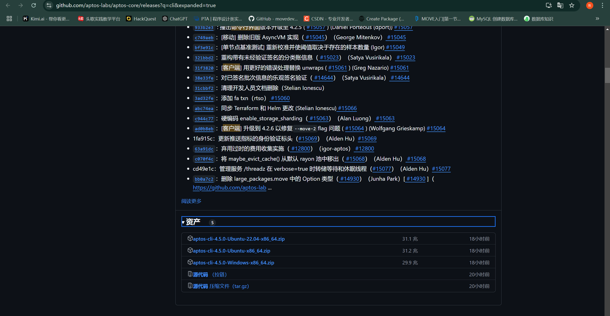


### 1.**解压下载的文件**

把下载的`aptos-cli-4.2.6-Windows-x86_64.zip` 文件解压到你想放到的位置，比如我的位置：D:\Aptos.CLI(这个看个人，你放在自己学习的磁盘里面嘛)

### 2.**打开文件所在目录**

导航到包含 `aptos` 可执行文件的目录。用我的地址举例，它位于 `D:\Aptos.CLI`。

导航的操作：首先使用win+R后输入cmd回车，进入终端

Cd:   后跟一个目录的地址

如果在同一个磁盘就会直接：

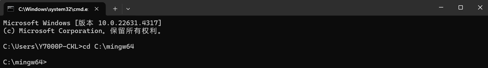

如果在不同磁盘则需要使用d:   /     e:(后面都要跟回车，如图所示)

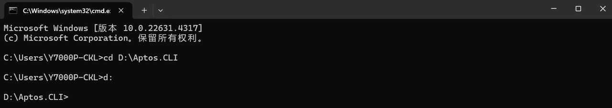


### 3.**添加执行文件到 PATH**

将 `aptos` 可执行文件的目录添加到你的系统 PATH 环境变量中，这样可以在任何命令行窗口中直接调用 `aptos`。

* 右键点击“此电脑”或“计算机”图标，选择“属性”。

* 点击“高级系统设置”。

* 在系统属性窗口中，点击“环境变量”。

* 在“系统变量”部分，找到并选择“Path”变量，然后点击“编辑”。

* 点击“新建”，然后输入 `aptos` 可执行文件所在的目录路径，例如 `D:\`Aptos CLI。

* 点击“确定”保存更改。

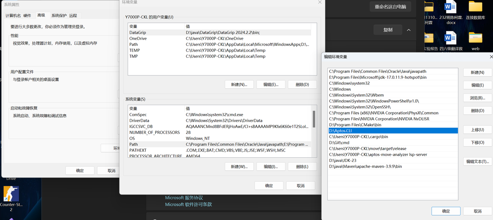

高亮的蓝色块是我的文件位置，我已将其配置到环境变量中，                  **配完了不要点×，点两次确定**

### 4.验证安装

打开一个新的命令提示符（CMD），确保它是以管理员身份运行的。

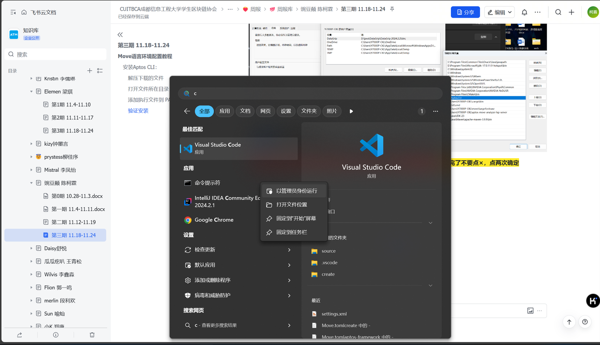

`aptos --help`

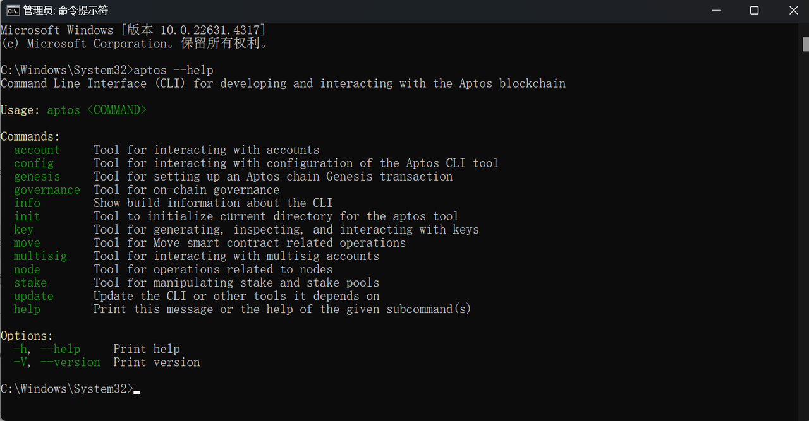

看到这个说明Aptos CLI配置成功了


# 三.创建(初始化)move包

### 1.**创建项目目录**：

在你的计算机上选择一个合适的位置，创建一个新的文件夹，这个文件夹将作为你的项目目录。

### 2.**初始化Move包**：

打开终端或命令行界面，导航到你刚才创建的项目目录中，然后运行初始化Move包的命令。这个命令通常是

`aptos move init --name my_project --package-dir .` (别忘了这个点)        其中`<package_name>`是你想要给Move包命名的名称。

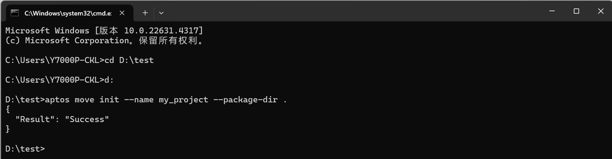

此时你会发现已经在你的新建目录中Move包已经初始化完成


### 3.更新你的Move.toml

（我用的VS code打开了这个文件夹，并在图片下方附上代码）

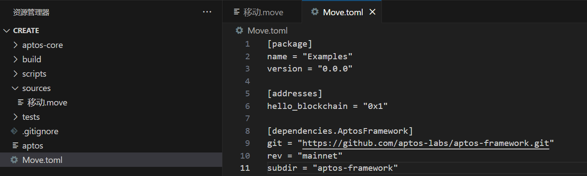

```toml
[package]
name = "Examples"
version = "0.0.0"

[addresses]
hello_blockchain = "0x1"

[dependencies.AptosFramework]
git = "https://github.com/aptos-labs/aptos-framework.git"
rev = "mainnet"
subdir = "aptos-framework"
```
### 4.添加到`sources`目录

附上代码

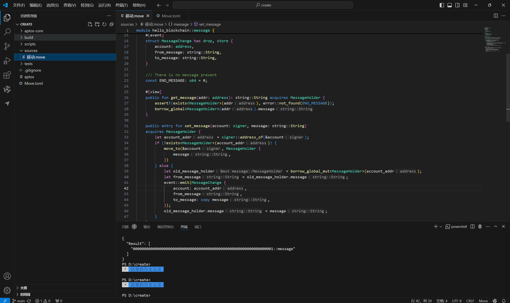

```move
module hello_blockchain::message {

    use std::error;
    use std::signer;
    use std::string;
    use aptos_framework::event;
    #[test_only]
    use std::debug;

    //:!:>resource
    struct MessageHolder has key {
        message: string::String,
    }
    //<:!:resource

    #[event]
    struct MessageChange has drop, store {
        account: address,
        from_message: string::String,
        to_message: string::String,
    }

    /// There is no message present
    const ENO_MESSAGE: u64 = 0;

    #[view]
    public fun get_message(addr: address): string::String acquires MessageHolder {
        assert!(exists<MessageHolder>(addr), error::not_found(ENO_MESSAGE));
        borrow_global<MessageHolder>(addr).message
    }

    public entry fun set_message(account: signer, message: string::String)
    acquires MessageHolder {
        let account_addr = signer::address_of(&account);
        if (!exists<MessageHolder>(account_addr)) {
            move_to(&account, MessageHolder {
                message,
            })
        } else {
            let old_message_holder = borrow_global_mut<MessageHolder>(account_addr);
            let from_message = old_message_holder.message;
            event::emit(MessageChange {
                account: account_addr,
                from_message,
                to_message: copy message,
            });
            old_message_holder.message = message;
        }
    }

    #[test(account = @0x1)]
    public entry fun sender_can_set_message(account: signer) acquires MessageHolder {
        let msg: string::String = string::utf8(b"Running test for sender_can_set_message...");
        debug::print(&msg);

        let addr = signer::address_of(&account);
        aptos_framework::account::create_account_for_test(addr);
        set_message(account, string::utf8(b"Hello, Blockchain"));

        assert!(
            get_message(addr) == string::utf8(b"Hello, Blockchain"),
            ENO_MESSAGE
        );
    }
}
```


# 四.编译

设置好包后，通过执行以下操作来编译 Move 代码：

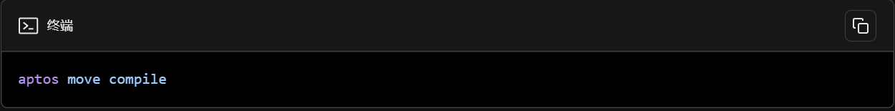

如果成功，则有

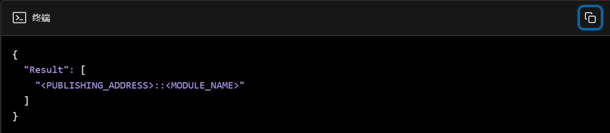


# 五.在Visual Studio Code上运行和调试

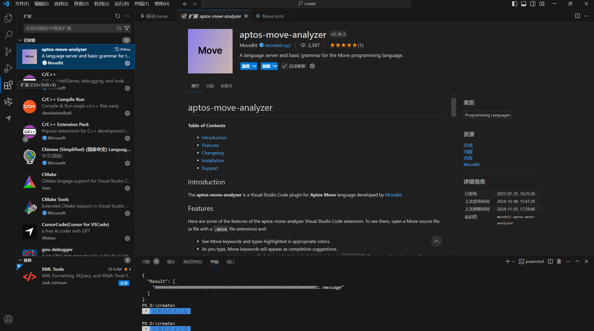

点击扩展(市场，如图)，下载这个插件

## **运行和调试**

* 现在可以通过VS Code的终端运行和调试Move代码，但需要确保Aptos CLI和Rust环境已正确配置在PATH中。

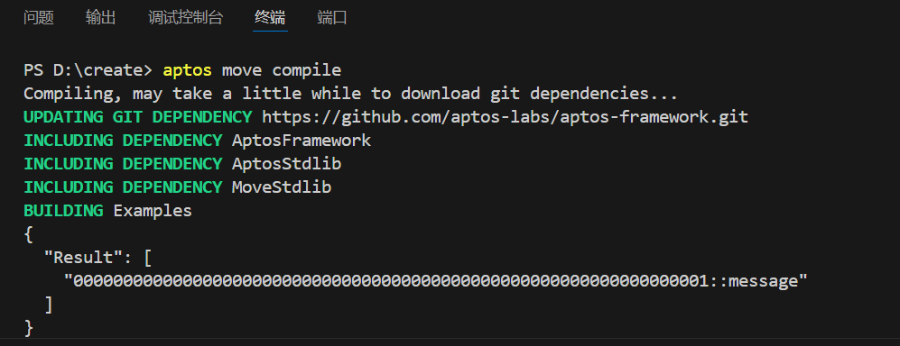

## 如果报错

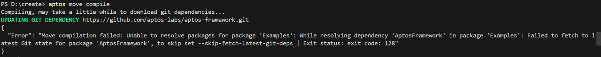

打开clash,点击终端(如图)


点击复制命令


将命令复制到VS code中终端里，再次执行aptos move compile即可
